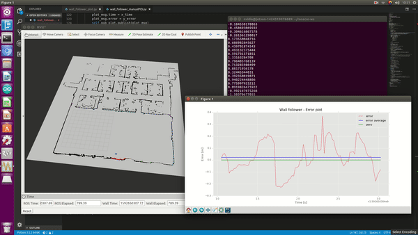

# autonomous-racecar-project

## Contents
1) Emergency brake (based on lidar data)
  - safety_node.py
2) Right wall following by PID control (based on lidar data)
  - wall_follower.py
  - wall_follower_manualPID.py
3) Wall following by PID control (optimum wall(right/left) is chosen based on lidar data)
  - pathplanning_ver2.0.py
  - pathplanning_ver2.1.py
4) Information-Theoretic Model Predictive Control (without GPU parallel computing)
  - ITMPC.py
  - IT_MPC_reference_data.py (data collecting code to train racecar neural net model)
  cf: Very simple version, Many things to supplement :(

## Result
1) Safety node

  

2) Wall following

  

3) Information-Theoretic Model Predictive Control (very simple version)

  

4) RCcar demo

  

## Reference
1) 'Information Theoretic Model Predictive Control: Theory and Applications to Autonomous Driving'
https://arxiv.org/abs/1707.02342
2) MIT racecar simulator
https://github.com/mit-racecar/racecar_simulator
  
